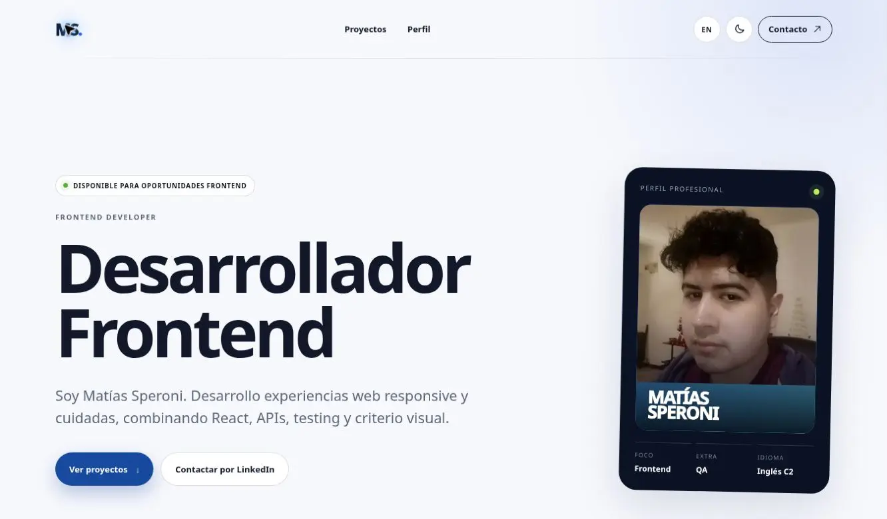

# Matías Speroni - Frontend Portfolio

A bilingual portfolio showcasing selected front-end, full-stack and UI projects. Built with Next.js and focused on responsive design, accessibility and a clear project-review experience.

[](https://nextjs.org/)
[](https://react.dev/)
[](https://www.typescriptlang.org/)
[](https://vercel.com/)

**[View live portfolio](https://matias-speroni-portfolio.vercel.app/)** · **[LinkedIn](https://www.linkedin.com/in/speroni-matias/)**

<p align="center">
  <a href="https://matias-speroni-portfolio.vercel.app/">
    
  </a>
</p>

## Overview

This portfolio presents Matías Speroni's experience, technical focus and selected projects through a single-page interface. Each project card opens an interactive case summary with its outcome, features, technology stack and original demo or repository.

The interface supports Spanish and English and preserves the selected language and color theme in the browser.

## Features

- Responsive layout for desktop, tablet and mobile screens
- Spanish and English interface
- Light and dark themes with saved preferences
- Filterable project gallery
- Accessible project-detail dialogs with keyboard support
- Categorized technology and tool explorer
- Direct links to live demos, GitHub, LinkedIn and email
- SEO metadata and social-sharing preview
- Reduced-motion support

## Selected projects

| Project | Type | Link |
| --- | --- | --- |
| Vitalidapp | Full-stack healthcare application | [Source](https://github.com/MattVmx/vitalidapp) |
| Punta Glacial | Ice cream shop website | [Live demo](https://mattvmx.github.io/puntaglacial-web/) |
| Macrotec | Real estate website | [Live demo](https://mattvmx.github.io/macrotec-web/) |
| Supremo | Restaurant website | [Live demo](https://mattvmx.github.io/supremo-web/) |
| SUCAR | Car dealership website | [Live demo](https://mattvmx.github.io/sucar-web/) |
| App Design | Visual landing page | [Live demo](https://mattvmx.github.io/app-visual-design/) |

## Tech stack

- Next.js 15
- React 19
- TypeScript
- CSS3
- Vercel

## Project structure

```text
portfolio-frontend-2026/
├── app/
│   ├── globals.css    # Design system and responsive styles
│   ├── layout.tsx     # Global metadata and page shell
│   └── page.tsx       # Portfolio content and interactions
├── public/images/     # Profile, project and social-preview assets
├── scripts/           # Build helpers
└── package.json
```

## Run locally

```bash
git clone https://github.com/MattVmx/portfolio-frontend-2026.git
cd portfolio-frontend-2026
npm install
npm run dev
```

Open [http://localhost:3000](http://localhost:3000) in your browser.

## Production build

```bash
npm run build
npm start
```

The production site is deployed automatically through Vercel.

## Author

Developed by **Matías Speroni**.

- [Portfolio](https://matias-speroni-portfolio.vercel.app/)
- [GitHub](https://github.com/MattVmx)
- [LinkedIn](https://www.linkedin.com/in/speroni-matias/)
